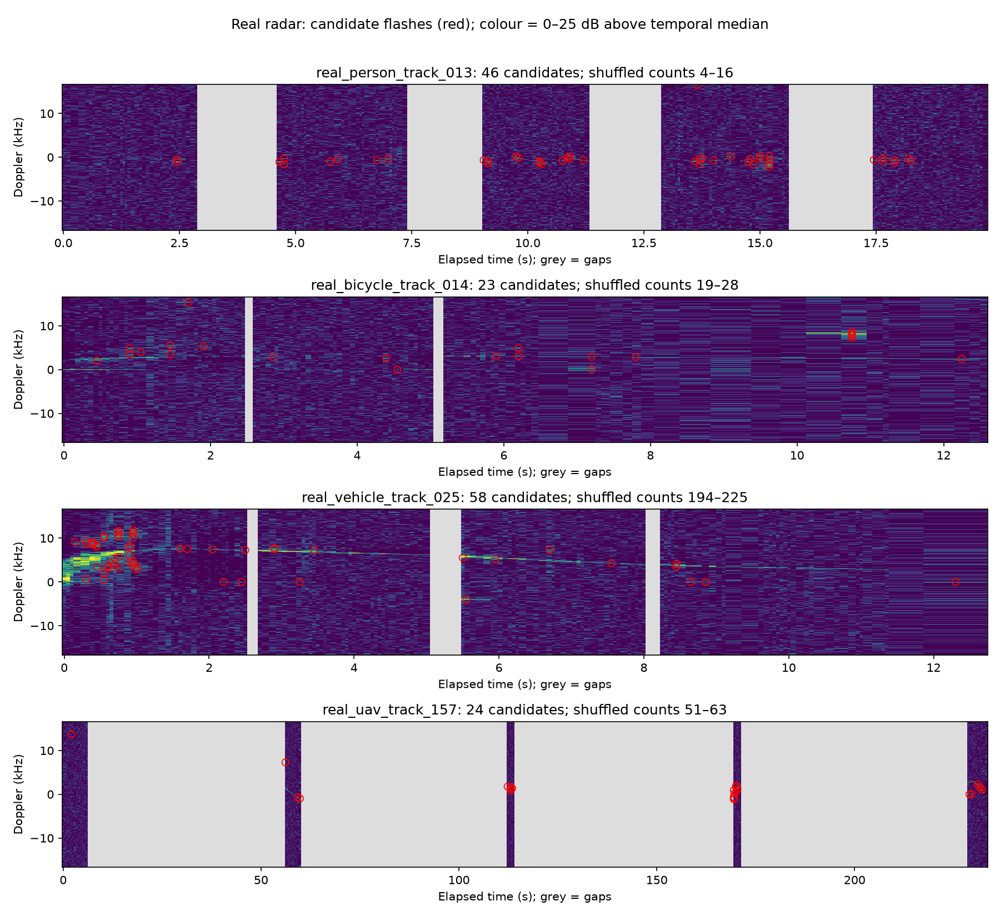

# Błyski bez zegara na rzeczywistym radarze

Wykrywamy krótkie, połączone obszary mocy co najmniej 10 dB ponad lokalnym tłem czasu i medianą widma klatki. Każdy kandydat ma >=3 piksele i trwa <=5 klatek. To detektor eksploracyjny offline: tło korzysta z całego fragmentu. Brak dopasowania zegara i prognozowania.

| Ślad | Kandydaci | Przetasowane kontrole: liczba | Mediana odstępu klatek [s] |
|---|---:|---:|---:|
| real_person_track_013 | 46 | 4–16 | 0.050 |
| real_bicycle_track_014 | 23 | 19–28 | 0.051 |
| real_vehicle_track_025 | 58 | 194–225 | 0.050 |
| real_uav_track_157 | 24 | 51–63 | 0.050 |

Czerwone obwódki wskazują maksima kandydatów; kolor to nadwyżka mocy nad medianą czasową danego binu (0–25 dB). Szare pola oznaczają brak danych, nie ciszę radaru. Zapisane fragmenty są krótkie i rozdzielone dużymi lukami.

Przetasowanie czasu niezależnie w każdym binie służy kontroli lokalnej spójności. Nie jest fizycznym modelem szumu, a jego wyniki nie są prawdopodobieństwem fałszywego alarmu. Różna liczba zdarzeń nie dowodzi łopat ani obrotów. Parametr 10 dB jest przyjętą definicją, nie progiem skalibrowanym na etykietach.

Źródło: [Open Radar Initiative](https://github.com/openradarinitiative/open_radar_datasets), Gusland et al. 2021, DOI 10.1109/RadarConf2147009.2021.9455239, CC BY-NC 4.0. To dostarczone przetworzone widma Dopplera. Rozdzielczość w czasie jest ograniczona odstępem klatek; krótkie błyski wewnątrz klatki mogą być nierozróżnialne. Nie ma niezależnych etykiet błysków ani RPM.

Szczegóły każdego zdarzenia (czas maksimum, zakres częstotliwości, długość, moc względem tła) i odstępy w obrębie ciągłych fragmentów: flash_results/summary.json. Nie łączymy odstępów przez luki, nie przeliczamy ich na RPM. Nie wybieramy najlepszego wyniku z czterech śladów.

Uruchomienie: `python -m unittest clock_experiment.test_flashes -v`; `python -m clock_experiment.run_flashes`. Wyniki chronione przed nadpisaniem. Protokół: FLASH_PROTOCOL.md; kod: flashes.py. Testy stałego pola, wstrzykniętego błysku i rozdzielenia luk powinny przejść przed badaniem realnym.
